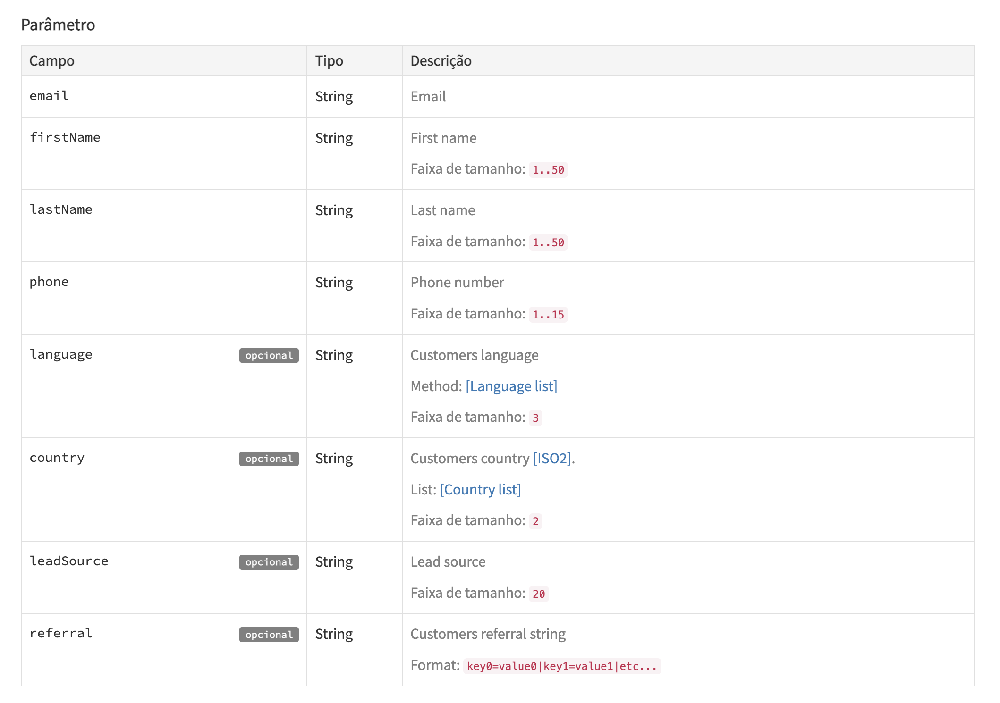

# Integração PandaTS CRM

Link planilha Okbox: https://docs.google.com/spreadsheets/d/19m90EO8FH1onE5hIhtS5q63FA45q9YFVMaKBvdOjZ2c/edit#gid=0

## Passos

1. Garanta que o IP Externo da sua máquina estará cadastrado corretamente na whitelist da API. Você pode fazer isso solicitando (caso seu e-mail estiver habilitado pelo cliente) para o endereço `support@pandats.com` (pode ser que seu IP mude em algum momento e você precise necessitar novamente)
2. Garanta que seu computador tenha NodeJS instalado. Download aqui: [https://nodejs.org/](https://nodejs.org/) (apenas uma vez)
3. Faça o download do projeto no botão verde CODE no início da página (apenas uma vez)
4. No terminal do seu computador, dentro da pasta que você fez o download, digite: `npm i` (apenas uma vez)
5. Crie um arquivo chamado `.env` a partir do `.env.template` e preencha com os valores corretos de API do cliente
6. Faça o download de leads a partir da planilha `.CSV` **(somente nesse formato)**
7. Salve o arquivo com o nome `leads.csv` (e somente assim) dentro dessa pasta
   2.1. Salve o arquivo por cima de outro, se houver
8. Garanta que a primeira linha do csv tenha as seguintes informações:

> firstName,lastName,email,phone,country,leadSource

Basta copiar e colar essa linha na primeira linha do leads.csv

11. Execute o programa com o comando no terminal `npm start`
12. Leia o terminal sempre para verificar o resultado da operação. Será algo parecido com:

```console
╰─ $ npm start

> okbox@1.0.0 start
> node index.js

Buscando o token...
Token adquirido com sucesso!

Sucesso na integração do lead 1 de email1@gmail.com
Sucesso na integração do lead 2 de email2@gmail.com

==== Conclusão ====
2 leads foram integrados com sucesso!
0 leads falharam!
```

## Obs importantes

A API tem restrições não muito claras sobre formatação de valores dos leads. Se algo de errado acontecer, verifique o terminal e comunique a pessoa responsável com um print e o conteúdo da tela. Pode aparecer algo assim:

```console
┌────────────┬──────────────────────────────────────────────────────────────────────────────────────────────────────────────────────────────────────────────────────────────────────────────────────────────────────────────┐
│  (index)   │                                                                                                    Values                                                                                                    │
├────────────┼──────────────────────────────────────────────────────────────────────────────────────────────────────────────────────────────────────────────────────────────────────────────────────────────────────────────┤
│   status   │                                                                                                     400                                                                                                      │
│ statusText │                                                                                                'Bad Request'                                                                                                 │
│  payload   │ '{"firstName":"nome8lvadossantos","lastName":0,"email":"email@gmail.com","phone":999999999,"country":"https://vcinvestindo.com.br/desvantagens-criptomoedas/","leadSource":"24/08/2022\\r"}' │
└────────────┴──────────────────────────────────────────────────────────────────────────────────────────────────────────────────────────────────────────────────────────────────────────────────────────────────────────────┘
Falha ao integrar lead 1 de email@gmail.com
```

Copie tudo, tire print e peça a orientação de alguém responsável. Você também pode analisar o possível problema checando:

- Se todos os campos obrigatórios estão preenchidos:

1. email
2. firstName
3. lastName
4. phone

- Se todos os campos obrigatórios são do tipo `String`. Ou seja, o valor do campo está entre aspas (`"`)
- Se todos os campo obedecem as restrições da imagem:
  
